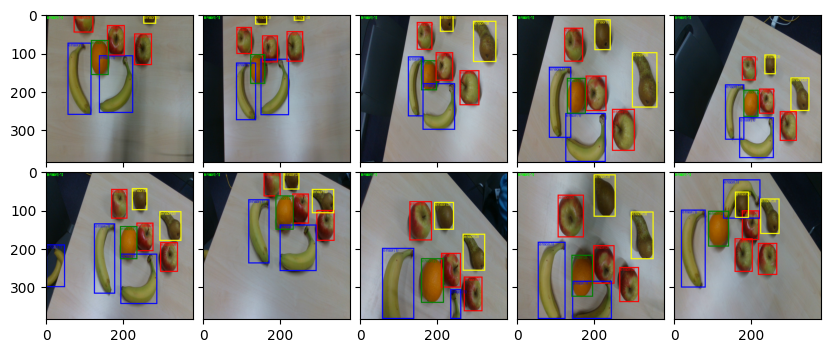
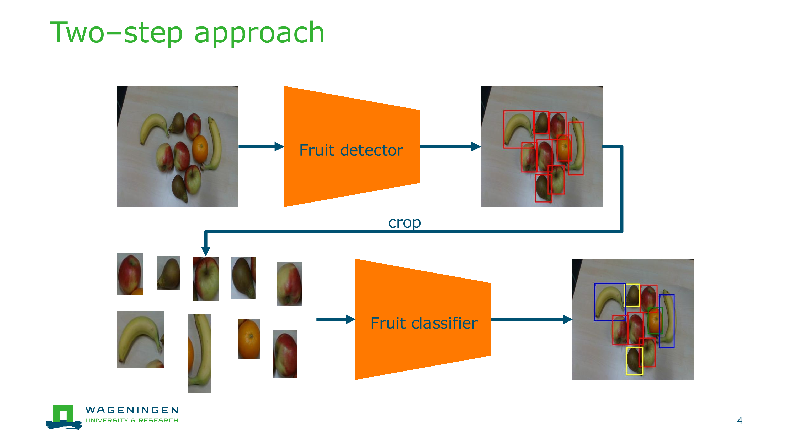
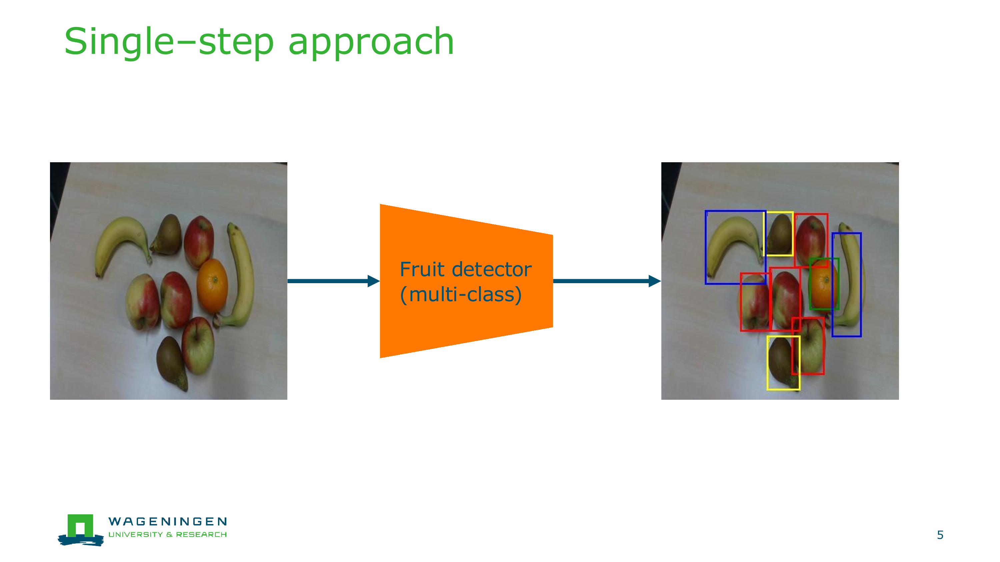
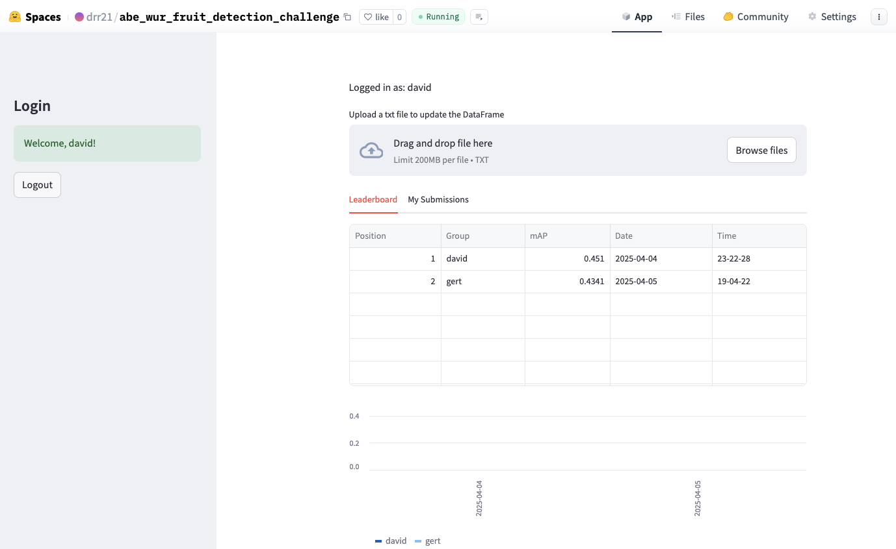

# ABE deep learning project: fruit detection

## Introduction
Object detection is a very relevant tasks for the agri-food industry. Some relevant examples are: 

- Detecting diseased plants from drone images.
- Detection of ripe fruits and relevant plant parts for robotic harvesting and manipulation.
- Detecting defects in post-harvested products such as fruit and vegetables.
- Detecting animals in barn environments as a way of monitoring their health and living conditions.
- And many more...

During this project, you'll go deeper into the computer vision task of object detection. The task at hand is to detect fruits in images as shown here:


The dataset consists of pictures of apples, bananas, oranges and pears. You will develop and compare two different approaches for object detection:

- **Two step approach.** This method can be defined as a fruit detection algorithm plus a fruit classifier model. In other words, you will first train a network to detect fruits independently of their class. Then, you will use the bounding boxes to crop the images and pass them to a classifier network, which will classify the bounding box as apple, banana, orange or pear.

- **Single step approach.**. This method uses a single network to perform object detection and classification. That is, your object detection network can now detect up to four different objects: apples, bananas, oranges and pears.


You should build your networks on top of the models developed during the tutorials. And add to them, usage of other model architectures is not allowed.

Annotation of test images and their use at training time is not allowed.

## Competition
In this project you will compete with all the other teams for the best mean Average Precision (mAP) performance on the test set. You **MUST** first develop both approaches to solve the fruit detection challenge (two step and single step). Then, you are free to choose the approach of your preference, and improve it further in order to win the competition.

The competition is hosted at [https://huggingface.co/spaces/drr21/abe_wur_fruit_detection_challenge](https://huggingface.co/spaces/drr21/abe_wur_fruit_detection_challenge). Every team will receive log in credentials to participate.

### How to participate
Use your credentials to log in into the challenge website. You should see something like this:



You now are able to upload your submissions (up to 10 per day!). The submission format should be a txt file as follow where predicted boxes are presented as `image_filename, cx, cy, w, h, class_id, confidence`. This is an example:

```
color_001.png, 0.9385692477226257, 0.12406756728887558, 0.15019071102142334, 0.22750574350357056, 3, 0.9989498257637024
color_002.png, 0.699505090713501, 0.38808369636535645, 0.25795409083366394, 0.4329442083835602, 2, 0.9999927282333374
color_002.png, 0.8748611807823181, 0.6965410709381104, 0.15483522415161133, 0.2767787575721741, 3, 0.9996340274810791
color_003.png, 0.5620995163917542, 0.36693891882896423, 0.3271831274032593, 0.43740174174308777, 2, 0.9999911785125732
color_004.png, 0.7048399448394775, 0.5529986619949341, 0.19585376977920532, 0.29669857025146484, 3, 0.9999991655349731
color_004.png, 0.6807190775871277, 0.18781284987926483, 0.18665297329425812, 0.3028806447982788, 3, 0.9999967813491821
color_004.png, 0.8595101237297058, 0.360429972410202, 0.2043967992067337, 0.3125438988208771, 3, 0.9999872446060181
color_005.png, 0.5389502048492432, 0.5513347387313843, 0.18025022745132446, 0.3195890188217163, 3, 0.9999912977218628
color_005.png, 0.5121865272521973, 0.2852896749973297, 0.1954585462808609, 0.274965763092041, 3, 0.9999532699584961
color_006.png, 0.25715094804763794, 0.9217860102653503, 0.17427219450473785, 0.1739407777786255, 2, 0.9999980926513672
````

Once you submit your first results, you will see your best results in the first tab, and the performance of all your submissions in the second tab.


## Mid-term deadline
The mid-term deadline is to show that you have one of the approaches (either two-step or single-step) working (training and generating predictions). Good accuracy is not a requirement at this point. 


## Project submission for grading
You need to submit a zip file containing the following:

- Report.
  - The report must show different experiments and modifications on the algorithms that aim to get a better performance on the challenge. Show at least different data augmentations, different backbones and multi-scale. You can add your own ideas too!
  - Even though you will not find papers that use this dataset. Use papers that perform object detection on fruits and discuss similarities and differences.
  - Discuss about which one of the two methods (single- and two- steps) perform better and why.
- All required notebooks and code per task. They must run without errors.
- For your best performant submission in the challenge:
  - The submitted .txt file.
  - Training code to replicate your best performant model. It must run and train without errors. 
  - The weights of the model and code to load them and replicate the .txt file. It must run without errors.


## Contact for help
Contact us on Teams for support:

- david.rapadorincon@wur.nl
- axel.streit@wur.nl